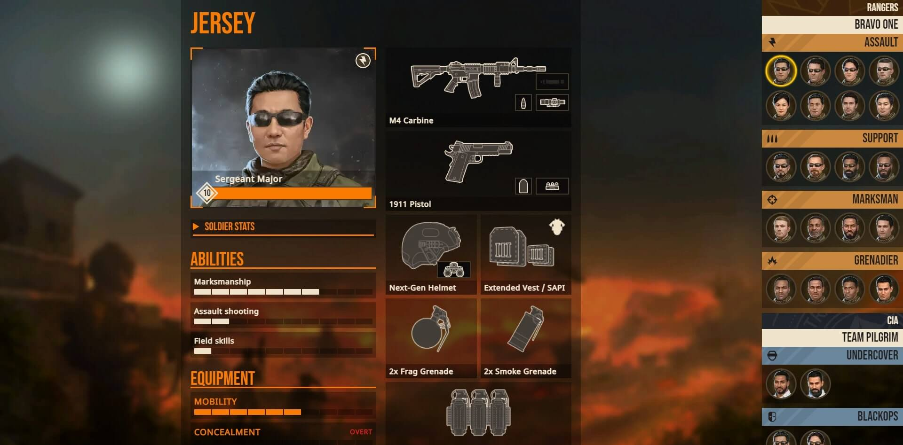

# Door Kickers 2 Loadout

> All game resources and images belong to their respective owner — [KillHouse Games](https://inthekillhouse.com) and are used with their permission

## Development

- Install dependencies: `npm install`
- Start dev-server: `npm run dev`
- Build for production: `npm run build`
